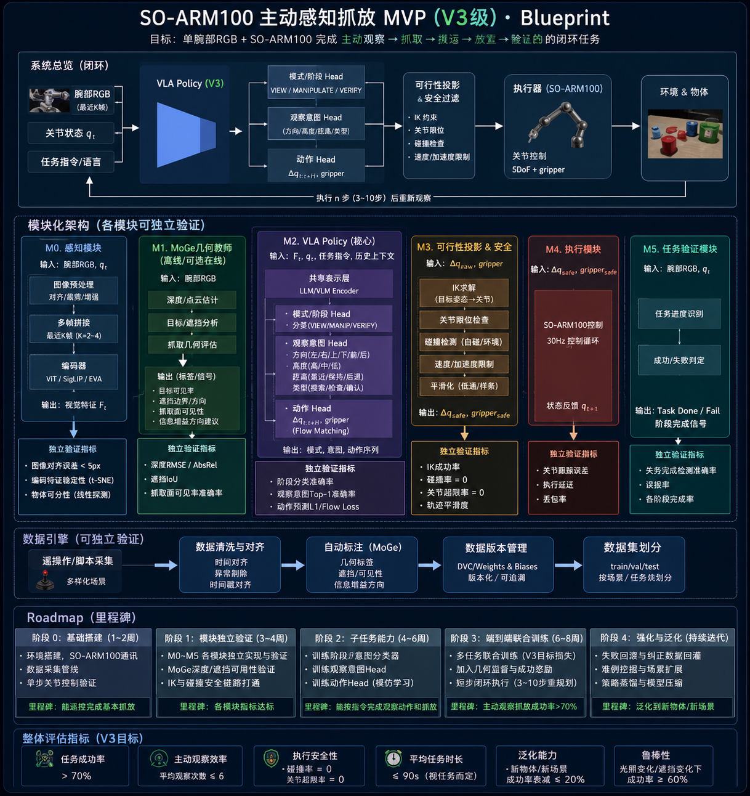

# so-snake

一个面向 **SO-ARM100 / SO-100** 的视觉抓放工作台：用手柄采集演示，导出
[LeRobotDataset](https://huggingface.co/docs/lerobot)，训练 ACT 或 pi0.5，并让策略通过同一套安全链路执行。



## 你可以做什么

- 用浏览器遥操作、录制双路相机数据、回看并筛选 take。
- 默认以 60 Hz 录制；导出训练集时默认严格下采样至 30 Hz。
- 在导出时选择相机 ROI；训练数据和 Rollout 自动使用同一裁剪。
- 在 GUI 中训练 ACT / pi0.5，支持 W&B、AutoDL（SSH + rsync）和模型批量删除。
- 在 Mock、MuJoCo 或真机上回放与执行策略；真机输出始终经过工作区、IK、关节速率和网格间隙保护。

## 30 秒跑起来

需要 Python 3.10+、Node.js（仅 GUI 首次构建）。

```bash
uv venv .venv --python 3.12
source .venv/bin/activate
uv pip install -e '.[dev]'

PYTEST_DISABLE_PLUGIN_AUTOLOAD=1 pytest -q
scripts/run_gui.sh
```

打开 <http://127.0.0.1:8770>。没有 `uv` 时，可把前两行换成标准 `python3 -m venv .venv` 和 `pip install -e '.[dev]'`。

想跑 MuJoCo：

```bash
uv pip install -e '.[dev,sim]'
```

## 最短工作流

1. 在「遥操作」页用 `mock` 或 `mujoco` 熟悉控制和相机。
2. 切到真机前，按 [真机启动指南](docs/real_arm_bringup.md) 完成标定、关节映射与只读 preflight。
3. 在「录制」页采集并审看 take。
4. 导出训练集：默认 60 → 30 Hz；按需设置 ROI。
5. 在「Train」页训练 ACT 或 pi0.5；pi0.5 选择 CUDA / AutoDL。
6. 在「Rollouts」页先用 Mock/MuJoCo 验证，再明确确认后上真机。

## 真机安全

真机有运动风险。首次运行请清空工作区、手放在断电/急停旁，并先小范围低速验证。运行策略前，务必确认相机角色、checkpoint、任务描述和动作空间。

```bash
PYTHONPATH=src .venv/bin/python scripts/preflight_real_arm.py
PYTHONPATH=src .venv/bin/python scripts/preflight_real_arm.py --probe  # 只读舵机探测
```

真机手柄、相机与舵机依赖属于可选的 `teleop` 安装层；具体环境与标定步骤见 [真机启动指南](docs/real_arm_bringup.md)。

## 项目结构

```text
src/so_snake/       运动学、安全、录制、导出与 GUI 后端
tools/gui/frontend/ React GUI
scripts/            GUI、采集、导出、回放与诊断入口
tests/              Mock / 离线回归测试
docs/               设计与硬件说明
```

更多实现背景可从 [GUI 文档](tools/gui/README.md)、[ACT 基线](docs/act_baseline.md) 和 [5D 任务空间设计](docs/plan_5dof_task_space.md) 开始。
